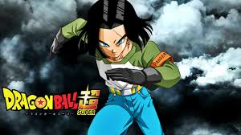
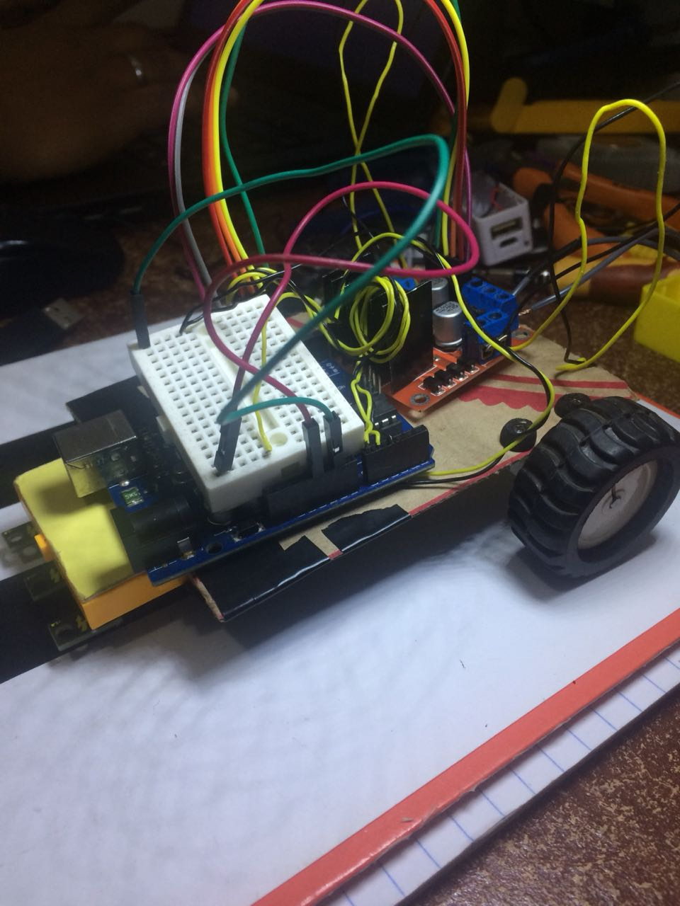
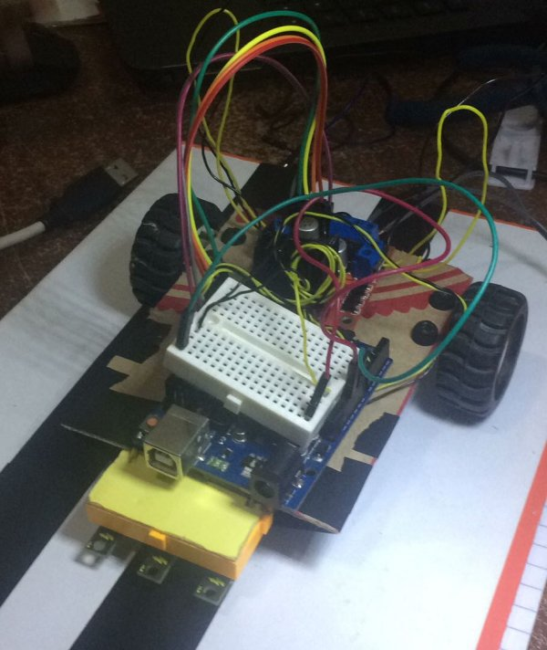
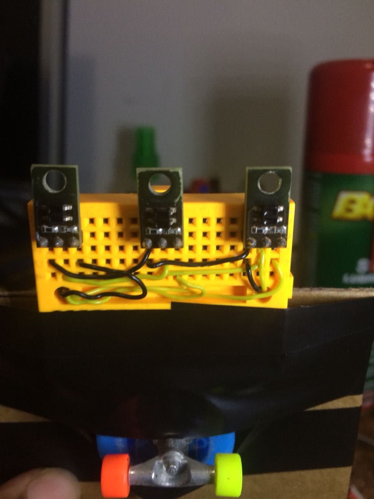

# Projeto nr 17

Projeto de robo seguidor de linha para o VII TUR , realizado pelo [PET eletrica]() da Universidade Federal de Uberlândia. O nome deste robô foi inspirado no grande mito, Androide nr 17 de dragon ball super 

## Materiais utilizados

- Arduino UNO R3
- Drive Ponte H l298
- Sensor de refletância
- Micro motor 1000 rpm
- Jumpers
- Protoboard

## Etapas de desenvolvimento

- [x] 1° Etapa- **Prototipagem**

Desenvolvimento do software e protótipo para testes de estratégia de controle.
Abaixo algumas imagens do primeiro protótipo criado

**OBS:** Este primeiro protótipo foi criado apenas com o intuito de testes prévios, este não será o robô usado na competição.

## Estratégia Empregada

Neste primeiro teste foi montado um array de 3 sensores. Para o controle PID desenvolvido , o setpoint é o sensor central e cada um dos laterais gera um certo erro pré-deteminado. Abaixo uma imagem do array.

De acordo com os erros gerados no percurso um tratamento de software para compensar o sistema é realizado. Por tentativa e erro as constantes do compensador serão refinadas.

## license

## Autors

Mário Borges - https://github.com/alpinista06
