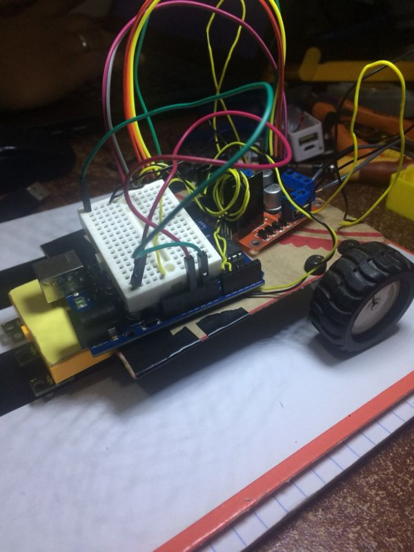

# Projeto nr 17

Projeto de robo seguidor de linha para o VII TUR , realizado pelo [PET eletrica](https://peteletricaufu.wordpress.com/) da Universidade Federal de Uberlândia. Abaixo segue uma imagem da pista e dos obstáculos a serem vencidos.

**CURIOSIDADE**  
O nome deste robô foi inspirado no grande mito, Androide numero 17 vencedor do torneio do poder em dragon ball super.

## Materiais utilizados

- Arduino NANO
- Drive Ponte H l298
- Sensor de refletância
- Sensor inercial gy512
- Micro motor 1000 rpm
- Jumpers
- Protoboard

## Etapas de desenvolvimento

- [x] 1° Etapa- **Prototipagem**

Desenvolvimento do software e protótipo para testes de estratégia de controle.
Abaixo algumas imagens do primeiro protótipo criado

**OBS:** Este primeiro protótipo foi criado apenas com o intuito de testes prévios, este não será o robô usado na competição.

## Estratégia Empregada

Para projetar este robô autônomo , em especial para o IIV TUR, listamos os obstáculos a serem vencidos em cada check point para então projetá-lo levando em conta as especificações apresentadas.
Foi montado um array de sensores. Para o controle PID desenvolvido, o setpoint é o sensor central e cada um dos laterais gera um certo erro pré-deteminado. Abaixo uma imagem do array.

De acordo com os erros gerados no percurso um tratamento de software para compensar o sistema é realizado. Por tentativa e erro as constantes do compensador serão refinadas e com esta abordagem dois obstáculos são vencidos.

## Resultados

Os resultados obtidos com este protótipo foram satisfatórios e podem ser vistos clicando no gif abaixo.

Com isso passamos para a segunda etapa, execução do projeto final.

- [ ] 2° Execução do projeto final

Etapa em andamento.

:smirk: 

## license

## Autors

Mário Borges - https://github.com/alpinista06
