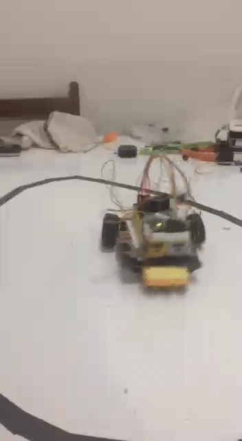

# Projeto nr 17

Projeto de robo seguidor de linha para o VII TUR , realizado pelo [PET eletrica](https://peteletricaufu.wordpress.com/) da Universidade Federal de Uberlândia. Abaixo segue uma imagem da pista e dos obstáculos a serem vencidos.

**CURIOSIDADE**  
O nome deste robô foi inspirado no grande mito, Andróide numero 17 vencedor do torneio do poder em [dragon ball super](https://pt.wikipedia.org/wiki/Dragon_Ball_Super).

## Materiais utilizados

- Arduino NANO
- Drive Ponte H l298
- Sensor de refletância
- Sensor inercial gy512
- Micro motor 1000 rpm
- Jumpers
- Protoboard

## Etapas de desenvolvimento

- [x] 1° Etapa- **Prototipagem**

Desenvolvimento do software e protótipo para testes de estratégia de controle.
Abaixo algumas imagens do primeiro protótipo criado

**OBS:** Este primeiro protótipo foi criado apenas com o intuito de testes prévios, este não será o robô usado na competição.

## Estratégia Empregada

Para projetar este robô autônomo , em especial para o VII TUR, listamos os obstáculos a serem vencidos em cada check point para então projetá-lo levando em conta as especificações apresentadas.
Foi montado um array de sensores. Para o controle PID desenvolvido, o setpoint é o sensor central e cada um dos laterais gera um certo erro pré-deteminado. Abaixo uma imagem do array.

De acordo com os erros gerados no percurso um tratamento de software para compensar o sistema é realizado. Por tentativa e erro as constantes do compensador serão refinadas e com esta abordagem dois obstáculos são vencidos.

## Resultados

Os resultados obtidos com este protótipo foram satisfatórios e podem ser vistos clicando no gif abaixo.

Com isso passamos para a segunda etapa, execução do projeto final.

- [x] 2° Execução do projeto final

**Algumas alterações** foram realizadas para buscar um melhor desempenho durante comeptição, entre elas estão a troca dos motores de 1000 rpm para motores de 300 rpm, com essa alteração conseguimos mais estabilidade no controle do robô, adicionamos 2 sensores óptico-reflexivos. O sensor inercial foi retirado, uma vez que com os motores de 300 rpm o torque obtido foi suficiente para vencermos a rampa sem esforço extra.
Com as mudanças realizadas os resultados se potencializaram, o robô ganhou torque, velocidade e estabilidade. O sistema de controle discreto projetado foi um [controle PD](https://pt.wikipedia.org/wiki/Controlador_proporcional_integral_derivativo) (proporcional-derivativo), o motivo pelo qual foi escolhida essa combinação foi que, em teoria e podendo ser observado na pratica, a ação integral zera o erro de regime permanente como na pista proposta não temos nenhum trecho que possa ser considerado análogo a um regime permanente a ação integral torna-se desnecessária.

## Estrutura final do robô

Com as alterações design final ficou da seguinte forma:

Vista frontal

Vista lateral

Vista superior

Vista inferior

A ideia inicial era de usar uma roda tipo esfera deslizante no eixo frontal, porém como não encontramos a tempo da cometição usando uma porca com ponta de semi-esfera que rendeu resultados satisfatórios. Os slotes de baterias forma dispostos de forma a balancear o centro de massa do carro.
**OBS:** A estrutura do robô foi refeita,à mão, 1 dia antes do inicio da competição, por esse motivo ele não ficou simétrico como era o esperado.

## Resultados na competição

Durante os testes observamos uma dificuldade em estabilizar o robô, esta dificuldade pode ser atribuída à posição dos sensores, que ficaram demasiadamente próximos ao eixo dos motores exigindo um tempo de resposta maior do sistema de controle. Apesar das dificuldades o melhor desempenho obtido nos rendeu o 4 lugar entre 13 equipes inscritas no torneio.

## license

This project is licensed under the MIT License - see the [LICENSE.md](LICENSE.md) file for details

## Autors

Mário Borges - https://github.com/alpinista06
Guilherme Balduino
Luiz Henrique (jabora) - https://github.com/rikpalmeiras
